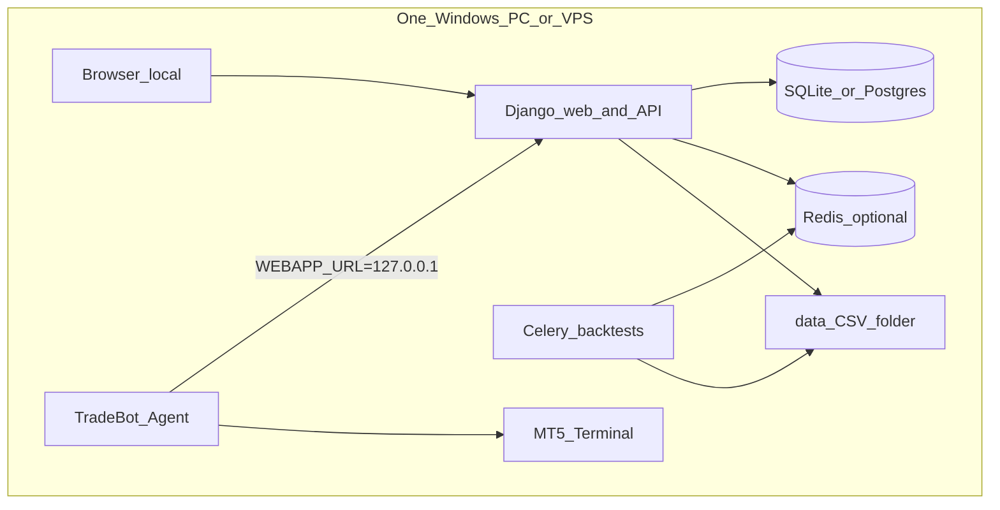
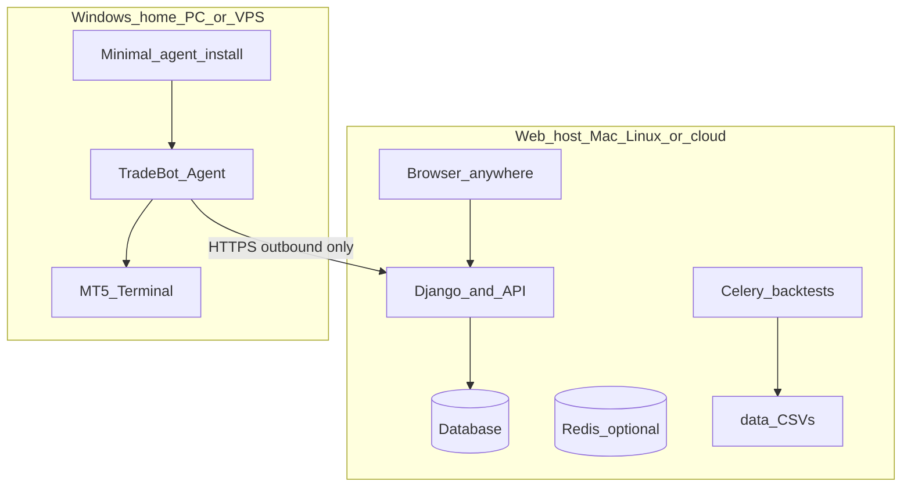
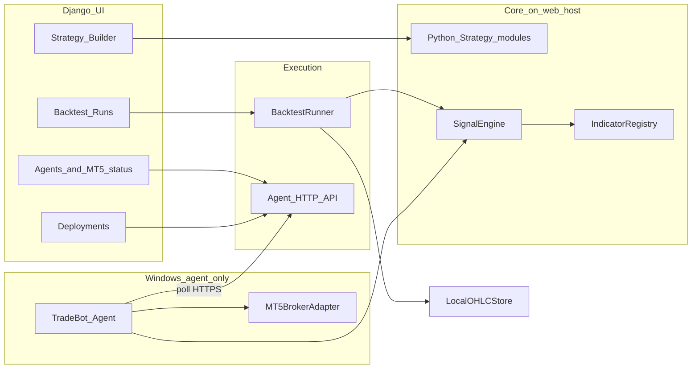

# TradeBot Django Trading Platform

> **Project plan** — includes full setup for **A (all-in-one)** and **B (split)** deployments. See [Deployment](#deployment-two-supported-setups-keep-both).

## Current state (2026-07-29)

**Phases 1–3 are implemented** in this repo. Session handoff: [untilNow.md](untilNow.md). GitHub: [Lvnc9/Forex-Stock-trader-Via-MetaTrader5](https://github.com/Lvnc9/Forex-Stock-trader-Via-MetaTrader5).

| Layer | Location | Notes |
| ----- | -------- | ----- |
| Web app | `config/`, `apps/`, `templates/` | Auth, strategies, marketdata, backtest, trading, brokers |
| Windows agent | `agent/` | `python -m agent`; `MetaTrader5` **only here** |
| Backtest data | [tradeBot/data/](tradeBot/data/) | M1 OHLC CSVs (not in git); see [data/README.md](data/README.md) |

**Still open:** human Windows demo MT5 smoke (HTF rules + library SL/TP — see `agent/README.md`); optional hardening (hedging accounts, deeper nested exprs, Parquet cache). Phases A–E + library SL/TP + automated LiveWorker smoke are in-repo — see [untilNow.md](untilNow.md).

`[mql-trading-app/](mql-trading-app/)` elsewhere in the monorepo is **unrelated**; this project does not use MQL.

---

## Python strategies + MetaTrader: no MQL required

**You do not need MQL** to trade through a MetaTrader broker for this app.


| Layer                 | Technology                                        | Role                                                                                         |
| --------------------- | ------------------------------------------------- | -------------------------------------------------------------------------------------------- |
| Strategy logic        | **Python** (your code + shared indicator library) | Backtest on local CSVs and produce signals for live                                          |
| Broker access         | Official `**MetaTrader5**` Python package         | Talks to a **running MT5 terminal** on the same machine                                      |
| MQL / Expert Advisors | **Not used**                                      | EAs are only needed if you want logic *inside* the terminal; we keep logic in Python instead |


**What the Python API can do without MQL:** `initialize` / login, read account and symbol info, pull bars (`copy_rates_`*), send and modify orders (`order_send`), read open positions and history. The **LiveWorker** polls for new bars, runs your Python strategy, and sends orders—functionally similar to an EA’s `OnTick`/`OnBar`, but the “brain” stays in Django/Python.

**Requirements (not MQL):**

- MT5 terminal installed, logged into your broker (demo or live), **Algo Trading** enabled.
- Python process and MT5 on the **same host** (typical setup: Windows PC or VPS co-located with the terminal).
- Mac dev: run MT5 + Python on a Windows VM/VPS; the Django UI can still run on Mac while the **trading worker** runs next to MT5.

**Optional later (still no MQL for core flow):** MetaApi.cloud or similar if you need remote MT5 without a local terminal—out of scope for v1 unless you ask for it.

**Market scope:** Forex + stocks only. Existing folders are mostly **indices/CFDs** (e.g. `usa500idxusd`); treat them as backtestable “stock market” proxies until you add true equity tickers. Extend the existing Dukascopy downloader for major FX pairs; add optional **yfinance** (or broker history via MT5) for named stocks in a later sub-phase.

---

## Deployment: two supported setups (keep both)

Both setups use the **same code** and the **same agent API**. The only difference is whether Django and the agent run on one Windows host or on separate machines.

| | **A — All-in-one** | **B — Split** |
| --- | --- | --- |
| **Django + DB + backtests** | Same Windows PC/VPS | Mac, Linux, or cloud VPS |
| **MT5 + TradeBot Agent** | Same Windows PC/VPS | Dedicated Windows PC or VPS |
| **Network** | `127.0.0.1` / localhost | Agent → web app over HTTPS (outbound) |
| **Best for** | First install, learning, single-user demo | Daily use from Mac laptop; 24/7 trading on Windows VPS |
| **Inbound firewall on Windows** | Not required (local browser only) | Not required (agent calls out) |

MT5 must always run on **Windows** next to the agent. The web app **never** imports `MetaTrader5` in split mode.

---

### Topology A — All-in-one (single Windows machine)



#### On-disk layout (all-in-one)

Everything lives under one project clone (e.g. `C:\tradeBot\`):

```text
C:\tradeBot\                          # git clone of tradeBot/
  manage.py
  config\
  apps\                               # Django apps
  agent\                              # TradeBot Agent package
  templates\
  static\
  data\                               # local M1 CSVs (backtest)
  .env                                # Django: SECRET_KEY, DEBUG, DATABASE_URL
  agent.env                           # Agent: WEBAPP_URL, AGENT_TOKEN
  venv\                               # one venv for Django + agent + shared libs
```

#### Processes (all-in-one)

| # | Process | Command / how to start | Notes |
| --- | --- | --- | --- |
| 1 | MT5 | Start from desktop; stay logged in | Algo Trading ON |
| 2 | Redis | `redis-server` or Windows Redis port | Optional; only if Celery backtests |
| 3 | Django | `python manage.py runserver 127.0.0.1:8000` | Or `gunicorn` for production on VPS |
| 4 | Celery | `celery -A config worker` | Optional; long backtests |
| 5 | Agent | `python -m agent` (from `agent.env`) | Polls local Django |

#### `agent.env` (all-in-one example)

```env
WEBAPP_URL=http://127.0.0.1:8000
AGENT_TOKEN=<paste from Broker → Add agent in UI>
# MT5_TERMINAL_PATH=C:\Program Files\Broker MT5\terminal64.exe
```

#### `.env` (Django example, same machine)

```env
SECRET_KEY=...
DEBUG=True
ALLOWED_HOSTS=127.0.0.1,localhost
DATABASE_URL=sqlite:///db.sqlite3
CELERY_BROKER_URL=redis://127.0.0.1:6379/0
```

#### Setup steps A (order matters)

1. Install **Windows 10/11** (64-bit).
2. Install **Python 3.11+** (64-bit), check “Add to PATH”.
3. Clone/copy project to `C:\tradeBot\`.
4. `python -m venv venv` → `venv\Scripts\activate` → `pip install -r requirements.txt` (+ agent deps).
5. `python manage.py migrate` → `python manage.py createsuperuser`.
6. Install broker **MT5**, log in (demo), enable **Algo Trading**.
7. Start Django: `python manage.py runserver 127.0.0.1:8000`.
8. Open `http://127.0.0.1:8000` → **Broker → Add agent** → copy token to `agent.env`.
9. Start agent: `python -m agent` (second terminal).
10. Confirm **Broker** page shows agent **Online** and MT5 account info.
11. Backtest in UI (uses `data\`), then **Deploy** to the local agent.

**Production on a Windows VPS (still all-in-one):** bind Django to `0.0.0.0` behind IIS/Caddy with HTTPS, set `ALLOWED_HOSTS`, keep `WEBAPP_URL` as the public URL the agent uses (same machine: `http://127.0.0.1:8000` or `https://your-vps`).

---

### Topology B — Split (web host + Windows trading box)



#### On-disk layout (split)

**Web host** (e.g. Mac `~/WorkFlow/tradeBot/` or Linux `/opt/tradeBot/`):

```text
tradeBot/
  manage.py
  config/
  apps/
  templates/
  static/
  data/                 # backtest CSVs live here only
  .env                  # Django settings, ALLOWED_HOSTS, DB
  venv/
```

**Windows trading machine** (minimal install — agent + MT5 only):

```text
C:\tradeBot-agent\
  agent\                # copy or pip install from same repo tag
  apps\strategies\      # shared strategy library (same version as web)
  venv\
  agent.env
```

Keep **agent repo version** in sync with web (same git tag or `pip install -e` from monorepo). Web sends `module_path` + parameters; agent must have matching strategy code.

#### Processes (split)

| Machine | Processes |
| --- | --- |
| **Web host** | Django, DB, optional Celery + Redis; **no MT5**, no `MetaTrader5` |
| **Windows** | MT5 + TradeBot Agent only; **no** public inbound ports |

#### `agent.env` (split examples)

LAN (dev):

```env
WEBAPP_URL=http://192.168.1.20:8000
AGENT_TOKEN=<token from web UI>
```

Internet (VPS web + home Windows or Windows VPS agent):

```env
WEBAPP_URL=https://tradebot.example.com
AGENT_TOKEN=<token from web UI>
```

#### `.env` (web host — split)

```env
SECRET_KEY=...
DEBUG=False
ALLOWED_HOSTS=tradebot.example.com,192.168.1.20
DATABASE_URL=postgres://...   # recommended if not localhost
CELERY_BROKER_URL=redis://127.0.0.1:6379/0
```

#### Setup steps B — web host first

1. Install Python 3.11+ on Mac/Linux/cloud.
2. Clone `tradeBot/`, venv, `pip install -r requirements.txt` (no `MetaTrader5` on this host).
3. Configure `.env`, `migrate`, `createsuperuser`.
4. Run Django (`runserver` for dev or gunicorn + nginx/Caddy for prod).
5. Ensure `data/` CSVs are present on **this** machine (backtests).
6. Open UI → **Broker → Add agent** → name e.g. `home-windows` → save **AGENT_TOKEN**.

#### Setup steps B — Windows trading machine

1. Install **MT5**, log in, **Algo Trading** on; optional auto-start MT5 on boot.
2. Install **Python 3.11+** 64-bit.
3. Deploy agent tree (`C:\tradeBot-agent\` or full monorepo clone).
4. `venv\Scripts\activate` → `pip install -r agent/requirements.txt` (includes `MetaTrader5`).
5. Set `agent.env` with `WEBAPP_URL` pointing to web host (must be reachable from Windows).
6. Test: `curl` or browser on Windows cannot reach web? fix firewall/DNS/TLS first.
7. Run `python -m agent` → web UI shows **Online**.
8. **Broker → Symbol map** for this agent; **Live trading → Deploy** to agent `home-windows`.

**Firewall summary (split):** Open **outbound** 443 (or 8000 on LAN) on Windows. Web host: expose **443** (HTTPS) to the internet only if you need access outside LAN; agent never needs inbound.

---

### Shared: web UI flow (both setups)

1. **Broker → Agents → Create** → copy `AGENT_TOKEN` into Windows `agent.env`.
2. Start agent; wait for **Online** (heartbeat ~30s).
3. **Symbol map** — catalog slug → MT5 symbol for your broker.
4. **Strategies** → parameters → **Backtest** (web host `data/`).
5. **Live trading → Deploy** → pick agent, confirm demo/live → agent pulls job on next poll.

### Agent ↔ API (both setups)

| Direction | Endpoint | Purpose |
| --- | --- | --- |
| Agent → Web | `POST /api/agent/heartbeat` | Online status, MT5 connected, account snapshot |
| Agent → Web | `POST /api/agent/sync` | Positions, deals, errors |
| Agent → Web | `GET /api/agent/deployments` | Armed jobs for this token |
| Response | JSON body | `module_path`, parameters, symbol, timeframe, risk |

Auth: `Authorization: Bearer <AGENT_TOKEN>` on every request.

### Windows checklist (both — trading machine)

1. Windows 10/11 64-bit (or Server).
2. MT5 installed, logged in, Algo Trading enabled.
3. Python 3.11+ 64-bit.
4. Agent installed + `agent.env` configured.
5. Agent process running (Service/Task Scheduler for 24/7).
6. v1: broker password stays in MT5 session on Windows — not stored in Django.

### Choosing A vs B

- Start with **A** on one Windows PC to validate backtest → deploy → MT5 demo in an afternoon.
- Move to **B** when you develop on Mac or want the web app on a stable VPS while MT5 stays on a trading VPS or home PC.

---


## Architecture (single strategy brain)




**Rule:** Backtest runs on the web host. Live runs on the agent using the **same** strategy module + parameters; `SignalEngine` code is shared (installed with both Django and agent from the same repo).

---

## Strategy model (Python-first)

Strategies are **Python modules**, not MQL and not a separate mini-language required for v1.

**Interface (conceptual):**

```python
class BaseStrategy:
    """Registered strategies live under apps/strategies/library/."""
    parameters: dict  # exposed in UI as typed fields (periods, levels, SL/TP, etc.)

    def on_bar(self, ctx: BarContext) -> Signal | None:
        """Called once per closed bar on the strategy timeframe."""
        ...
```

- `**BarContext**`: pandas OHLCV (primary + optional HTF), precomputed indicators via `**IndicatorRegistry**` (SMA, EMA, RSI, MACD, BB, ATR, cross helpers, session filters).
- `**Signal**`: `enter_long` / `enter_short` / `exit` / `close_all` plus optional SL/TP metadata consumed by backtester and MT5 adapter.
- **Django `Strategy` model**: name, description, `**module_path`** (e.g. `strategies.library.ma_crossover`), `**parameters` JSON**, version/hash for audit.

**UI (how users “take” a strategy):**

1. **Pick a library strategy** → configure parameters in forms (covers most technical setups).
2. **Custom strategy** → upload or paste Python into `apps/strategies/user/` (admin-approved or dev-only v1), must subclass `BaseStrategy`; validator runs import + dry-run on sample bars before save.
3. **Review step** → show docstring + parameter summary + last backtest link before **Deploy to MT5**.

**Why Python instead of JSON DSL:** Expresses arbitrary technical logic (multi-timeframe, custom indicators, state machines) in one language for backtest and live; the app’s job is to **load, parameterize, validate, and run** that code—not to compile MQL.

**Shared library:** Ship 3 reference strategies (MA crossover, RSI reversal, range breakout) as Python ports of the ideas in `[mql-trading-app](mql-trading-app/)`—same ideas, **no shared code** with MQL.

---

## Local data layer

New Django app `marketdata`:

- **Catalog** scans `[tradeBot/data/{slug}/](tradeBot/data/)` (`months/*.csv`, yearly aggregates) and exposes instrument, date range, bar count.
- **Loader** (`pandas`): read M1 → resample to strategy TF → align HTF series for multi-timeframe rules.
- **Symbol map** model: `catalog_slug` → `dukascopy_id` → **MT5 symbol** (broker-specific, user-editable—critical because MT5 names differ by broker).
- Reuse/adapt dukascopy download pattern from `[tradeBot/data/dow/_work/package.json](tradeBot/data/dow/_work/package.json)` as a **management command** `download_bars` (FX majors first for forex scope).

---

## Backtest engine

New app `backtest`:

- **BacktestRun** model: strategy FK, symbol, date range, TF, initial balance, fees/spread assumptions, status, metrics JSON, artifact paths.
- **BacktestRunner**: bar-by-bar loop, apply SL/TP on OHLC (conservative intrabar rule: SL before TP if both hit same bar, documented).
- **Primary metric for you:** **win rate %** = winning trades / closed trades; also show net return %, profit factor, max drawdown, trade count, equity curve.
- Long runs: **Celery task** + progress polling (HTMX or small JSON endpoint).

Charts: **Lightweight Charts** or Chart.js for equity + optional price with entry/exit markers.

---

## MetaTrader 5 integration

New app `brokers`:

- **TradingAgent** model: name, `token_hash`, last heartbeat, MT5 account metadata, online flag.
- **BrokerConnection** (optional v1): links UI label to an agent; demo/live inferred from MT5 account info agent reports.
- **MT5BrokerAdapter** — lives **only in agent process**: `connect`, `account_info`, `symbol_info`, `positions`, `order_send`, `copy_rates_from_pos`.
- **Deployment** model: strategy + **agent** + symbol + lot/risk + `armed`/`paused` + kill switches.
- **Agent loop** (on Windows): poll deployments → on new bar run `SignalEngine` → orders via MT5 → sync status to web API.

Safety UX: deploy requires **explicit confirm** for live accounts; demo default; navbar shows **Demo/Live** from last agent sync.

---

## Django project layout (new files under tradeBot/)

```text
tradeBot/
  manage.py
  config/                 # settings, urls, celery, wsgi
  apps/
    core/                 # base templates, dashboard
    strategies/           # Strategy model, Python library, loader, param UI
    marketdata/           # catalog, loaders, symbol map
    backtest/             # runs, engine, tasks
    trading/              # deployments, live worker hooks
    brokers/              # MT5 adapter, connection UI
  templates/              # base layout, components
  static/                 # built Tailwind, HTMX, charts
  agent/                  # TradeBot Agent (runs on Windows next to MT5)
  requirements.txt
  README.md
  data/                   # unchanged existing CSVs
```

**Stack:** Django 5, `django-environ`, SQLite dev / Postgres optional, **Celery + Redis** for **backtests only** on web host, **pandas** + **pandas-ta**, **MetaTrader5** only in `agent/`.

---

## UI / navigation (proposed)

Dark, clean **sidebar + top bar** (Tailwind; e.g. slate/zinc palette, accent for long/short).


| Nav item         | Purpose                                                                          |
| ---------------- | -------------------------------------------------------------------------------- |
| **Dashboard**    | Active deployments, last backtest win rate, account snapshot (if MT5 connected)  |
| **Strategies**   | List, create/edit wizard, duplicate, archive                                     |
| **Backtest**     | Pick strategy + local symbol + range → run → results table + charts              |
| **Live trading** | Deployments table, start/pause, open positions & recent fills                    |
| **Broker**       | Register Windows **agents**, token, online/offline, symbol map, account snapshot |
| **Data**         | Local dataset inventory, gaps, optional download command trigger                 |
| **Settings**     | Risk defaults, timezone (UTC), user prefs                                        |


Global: connection status pill (MT5 connected / disconnected), environment badge (Demo/Live).

Interaction style: **server-rendered Django templates + HTMX** for forms and run progress (fast to ship, still modern); minimal Alpine.js for toggles (AND/OR groups).

---

## Phased delivery

### Phase 1 — Foundation + backtest (usable without MT5) — **done**

- Django project scaffold, auth (login), base UI shell.
- Python `BaseStrategy` + indicator registry; 3 **example strategies** in `strategies/library/` (MA cross, RSI reversal, range breakout).
- Market data catalog + loader wired to existing CSVs.
- Backtest runner + results UI with **win rate %** and equity chart.

### Phase 2 — Strategy UX — **done**

- Parameter forms per library strategy; custom Python strategy upload with validation.
- Backtest history and compare runs; deploy review before live.

### Phase 3 — MT5 demo/live — **done (v1)**

- Agent API (`/api/agent/*`), Bearer token auth, Broker UI (create agent, online status).
- `Deployment` lifecycle (draft → armed / paused / stopped); `/live/` sync UI (positions, deals, errors).
- `agent/live_worker.py` + `mt5_adapter.py`: new-bar loop, shared strategy code, market orders.
- Setup: [agent/README.md](agent/README.md), `agent.env.example`, Windows Service / NSSM docs + `agent/scripts/install-service-nssm.ps1`.

### Phase 4 — Data & stocks breadth — **done (v1)**

- FX pair downloads via Dukascopy management command (`download_bars`).
- Stock symbols via `download_stocks` (yfinance); documented limitations vs M1 forex CFD data.

---

## Post–Phase 3 backlog

Prioritize with [untilNow.md](untilNow.md). Items below marked when completed in polish slices.

| Item | Area | Goal | Status |
| ---- | ---- | ---- | ------ |
| Live/backtest parity | `agent/`, `apps/strategies/position_intent.py` | SL/TP on broker, flip rules aligned | **done (v1)** |
| Symbol map UX | `apps/marketdata/` | Editor outside Django admin; validate before deploy | **done** |
| Deployment event log | `apps/trading/` | Auditable state changes + agent errors | **done** |
| Celery backtests | `apps/backtest/tasks.py` | Async long runs + HTMX progress (eager default) | **done** |
| Windows Service | `agent/` docs | Run agent as service on trading VPS | **done** |
| Phase 4 data | management command | FX majors + stock path per plan | **done** |
| HTF + engine unify | `SignalEngine`, `BacktestRunner`, live worker | Optional HTF bars for backtest/live; shared bar loop | **done (Phase C)** |
| Rules engine + builder | `apps/strategies/rules/` | JSON rule-spec strategies + fixed-slot builder UI | **done (Phases A/B)** |
| Builder expr + HTF inds | `rules/builder.py`, templates | pct_offset/arith in UI; indicator `source: htf` | **done (Phase D)** |
| HTF gate + seed templates | forms, `seed_rule_templates`, agent docs | Require HTF when needed; seed + smoke path | **done (Phase E)** |

Agent workflow templates: [docs/WORKFLOW.md](docs/WORKFLOW.md).

---

## Key risks & mitigations


| Risk                                      | Mitigation                                                          |
| ----------------------------------------- | ------------------------------------------------------------------- |
| MT5 Python only works with local terminal | **Agent on Windows** next to MT5; web app never imports MetaTrader5 |
| Home PC behind NAT                        | Agent uses **outbound HTTPS only**; no inbound firewall             |
| Broker symbol names ≠ catalog ids         | Symbol map UI + validation before deploy                            |
| Intrabar SL/TP ambiguity                  | Fixed documented rule; optional “tick mode” later                   |
| Huge M1 CSV memory                        | Date-chunked reads; optional Parquet cache command later            |


---

## Success criteria

- User can run a **parameterized Python strategy** or add **custom Python** that passes validation; backtest and live use identical modules. — **met**
- Backtest on `[tradeBot/data/](tradeBot/data/)` returns **win rate %** and supporting metrics on a chosen range. — **met**
- Same strategy deploys to **MT5 demo**, places/closes orders per rules, with pause and live-account safeguards. — **met (v1)**; refine execution parity in backlog above.

